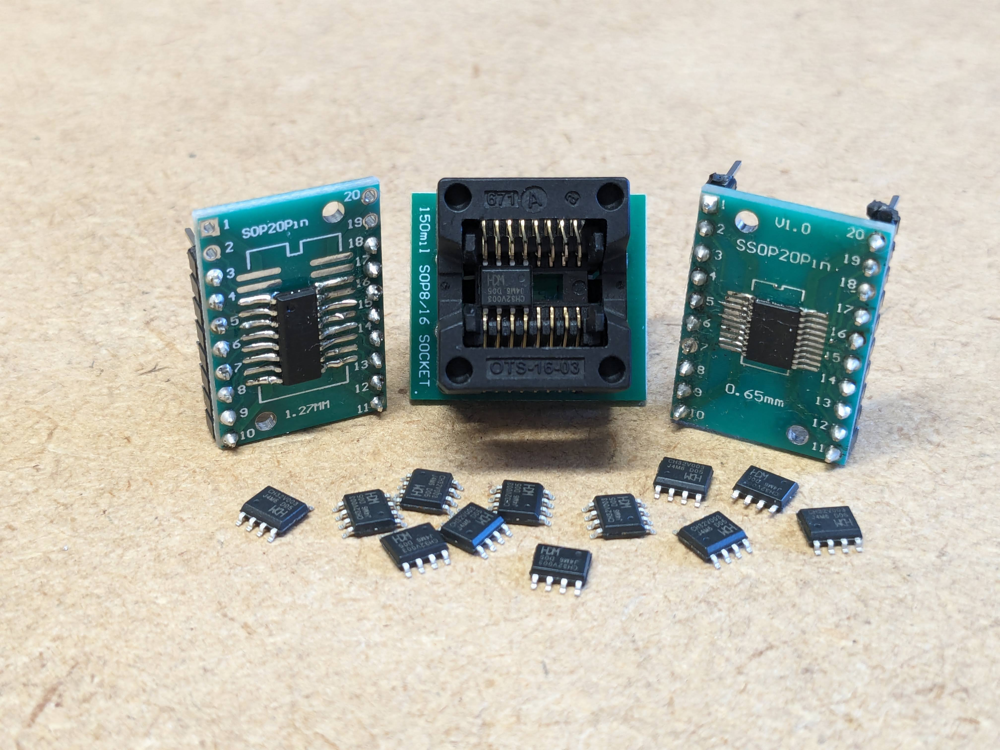

# CH32V003 MCU Codebeispiele

Dieses GitHub-Repository enthält eine Sammlung von Codebeispielen für die Programmierung des CH32V003-Mikrocontrollers.

## Inhalt:

- **WCH LinkE Setup:** Einrichtung der WCH LinkE für die Verwendung von CH32v003 MCUs.

- **LED-Blink:** Ein einfaches Beispiel, das zeigt, wie man eine LED auf dem CH32V003-Mikrocontroller blinken lässt.

- **AnalogRad:** Beispiel zur Nutzung der analogRead Funktion des CH32V003 für die Erfassung von Daten aus einem Potentiometer.

- **UART:** Ein einfaches UART-Beispiel, das die serielle Kommunikation zwischen dem CH32V003 und einem Arduino Uno demonstriert.

- **UART mit Bluetoothmodul:** Erweitertes Beispiel, das die UART-Kommunikation mit einem Bluetooth-Modul integriert, um drahtlose Datenübertragungsfähigkeiten zu demonstrieren.

- **I2C Beispiel:** Demonstration die Verwendung von I2C mit dem CH32V003-Mikrocontroller.

Viel Spaß beim Coden! 🚀

